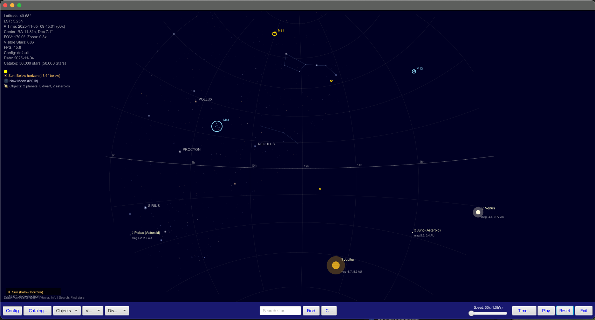

# planetarium

Planetarium Running JavaFX on JDK 21 with Maven

## Description

The Planetarium application is an interactive visualization software designed to simulate a planetarium experience. It utilizes advanced astronomical data from the HYG catalog to render stars with varying sizes based on their magnitude. The application employs spatial indexing using QuadTree for efficient star lookups, ensuring quick access and rendering without significant lag.

Key features of the Planetarium application include:
1. **Star Rendering**: Displays stars from the HYG catalog, with magnitudes determining size and full spectral type classification (O, B, A, F, G, K, M)
2. **Spatial Indexing**: Uses a QuadTree to achieve O(log n) query performance, enhancing efficiency in star lookups
3. **Astronomical Calculations**: Accurately calculates visibility and coordinate projection for precise celestial mechanics simulation
4. **Optimized Performance**: Runs smoothly at 60 FPS with position caching, ensuring fluid animations and real-time interactions
5. **Interactive Controls**: Offers users the ability to manipulate the visualization through various controls typical in planetarium software

The application is built using JavaFX 21, providing modern graphical capabilities and cross-platform compatibility. It is production-ready, suitable for deployment in educational or public settings where users can explore celestial mechanics interactively.

### Features

- **Star Rendering**: Displays stars from HYG catalog with magnitude-based sizing and spectral classification
- **Spatial Indexing**: QuadTree O(log n) queries for fast star lookups
- **Astronomical Calculations**: Accurate visibility and coordinate projection
- **Optimized Performance**: 60 FPS with position caching
- **Interactive**: Support for pan and zoom
- **Data Formats**: Supports both HYG catalog and custom JSON star data formats

## Known Issues

### String Index Out of Bounds Exception
- **Issue**: `StringIndexOutOfBoundsException` occurring in `PlotController.drawInfo()` at line 1647
- **Cause**: Attempting to extract substring with indices [0, 19) from a string with length 16
- **Status**: Under investigation - likely related to spectral type or star name string parsing
- **Workaround**: Ensure all string operations check length before substring extraction

### Star Distribution Visualization
- **HYG Data**: Currently displays as a cone of stars rather than spherical distribution
- **JSON Data**: Shows proper spherical distribution across the display
- **Investigation**: Reviewing coordinate transformation and projection algorithms

## Data Files

The application supports two star data formats:

1. **stars.json**: Custom format with uniform sky distribution
2. **stars_1k.json**: Subset of 1,000 stars for testing
   - RA range: 0-24 hours
   - Dec range: -90° to +90°
   - Includes proper names and spectral classifications

## Screenshots 11/05/2025



## Screenshots 11/04/2025


### Northern Sky: 09/27/2021 - 21:08


### Southern Sky: 09/27/2021 - 21:08


## Build & Run

```bash
# Build the project
mvn clean install

# Run the application
cd gui
mvn javafx:run